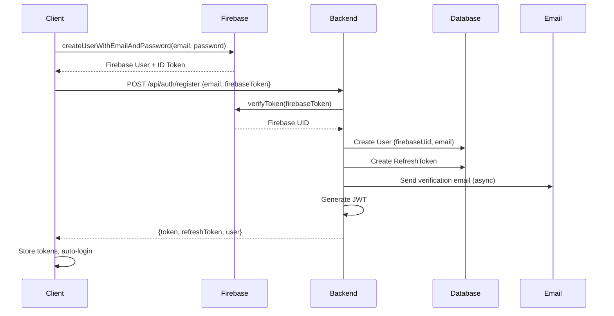
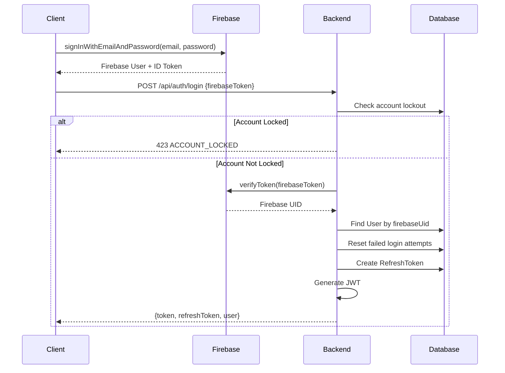
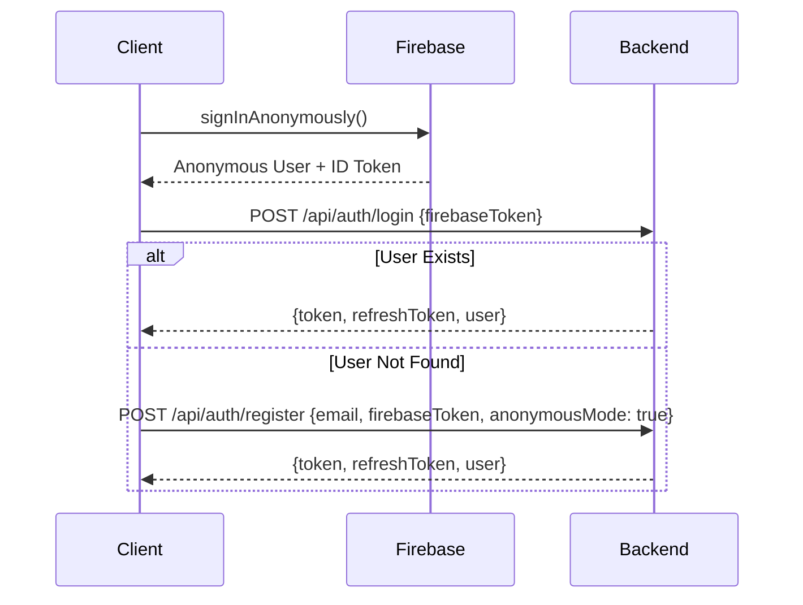
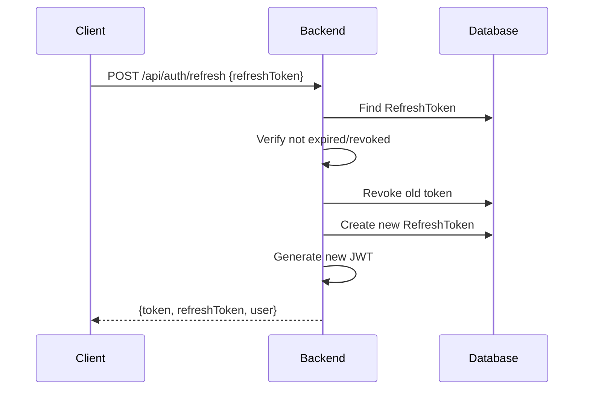
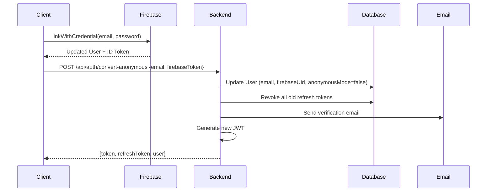
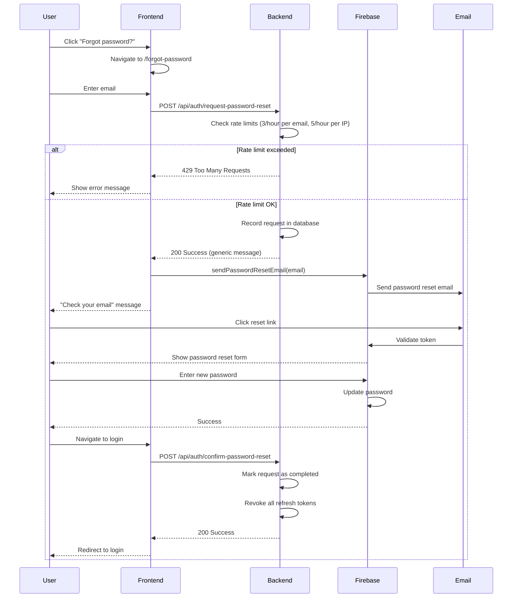

# MindEase Authentication Architecture

## Overview

MindEase uses a hybrid authentication system combining **Firebase Authentication** for credential management and **JWT tokens** for API authorization. This architecture provides:

- Secure credential handling via Firebase
- Stateless API authentication via JWT
- Refresh token rotation for extended sessions
- Support for both regular and anonymous users
- Account lockout protection
- Email verification

---

## Architecture Components

### 1. Firebase Authentication

**Purpose**: Handles user credentials and provides secure ID tokens

**Responsibilities**:

- Email/password authentication
- Anonymous authentication
- Token generation and validation
- Password reset (future)

**Flow**:

```
Client → Firebase Auth → ID Token → Backend Verification → JWT Generation
```

### 2. JWT (JSON Web Tokens)

**Purpose**: Stateless API authorization

**Token Types**:

- **Access Token**: Short-lived (24 hours), used for API requests
- **Refresh Token**: Long-lived (7 days), used to obtain new access tokens

**Claims**:

```json
{
  "sub": "user@example.com",
  "role": "USER",
  "userId": "uuid",
  "anonymousMode": false,
  "iat": 1234567890,
  "exp": 1234654290
}
```

### 3. Database Models

#### User

- Primary user account information
- Fields: `id`, `email`, `firebaseUid`, `role`, `anonymousMode`, `emailVerified`, `banned`

#### RefreshToken

- Stores refresh tokens with expiration and revocation
- Fields: `id`, `token`, `userId`, `expiresAt`, `revoked`, `revokedAt`

#### UserActivity

- Tracks login attempts and account lockout
- Fields: `id`, `userId`, `lastActiveAt`, `failedLoginAttempts`, `lockedUntil`

#### EmailVerificationToken

- Stores email verification tokens
- Fields: `id`, `token`, `email`, `expiresAt`, `usedAt`

---

## Authentication Flows

### Registration Flow



**Endpoint**: `POST /api/auth/register`

**Request**:

```json
{
  "email": "user@example.com",
  "firebaseToken": "firebase-id-token",
  "anonymousMode": false
}
```

**Response**:

```json
{
  "status": "success",
  "message": "Registration successful",
  "token": "jwt-access-token",
  "refreshToken": "refresh-token-uuid",
  "user": {
    "id": "user-uuid",
    "email": "user@example.com",
    "role": "USER",
    "anonymousMode": false
  }
}
```

### Login Flow



**Endpoint**: `POST /api/auth/login`

**Request**:

```json
{
  "firebaseToken": "firebase-id-token"
}
```

**Response**: Same as registration

**Error Codes**:

- `USER_NOT_FOUND` (404): User doesn't exist
- `ACCOUNT_LOCKED` (423): Too many failed attempts
- `INVALID_FIREBASE_TOKEN` (401): Firebase token invalid

### Anonymous Login Flow



### Token Refresh Flow



**Endpoint**: `POST /api/auth/refresh`

**Token Rotation**: Old refresh token is revoked, new one is issued

### Convert Anonymous Account Flow



**Endpoint**: `POST /api/auth/convert-anonymous`

---

## Security Features

### 1. Account Lockout

**Configuration**:

- Max attempts: 5 (configurable via `account.lockout.max-attempts`)
- Lockout duration: 30 minutes (configurable via `account.lockout.duration-minutes`)

**Behavior**:

- Failed login attempts are tracked per user
- After 5 failures, account is locked for 30 minutes
- Successful login resets the counter
- Returns 423 status with `ACCOUNT_LOCKED` code

### 2. Rate Limiting

**Endpoints**:

- `/api/auth/login`: 5 requests per 15 minutes per IP
- `/api/auth/register`: 5 requests per 15 minutes per IP
- `/api/auth/me`: 100 requests per 15 minutes per IP

**Response**: 429 status with `RATE_LIMIT_EXCEEDED` code

### 3. JWT Secret Validation

**On Startup**:

- Validates JWT secret is strong (≥32 characters)
- Checks for common weak patterns
- Fails fast in production if weak secret detected

### 4. Firebase Token Expiration

**Validation**:

- Checks `exp` claim from Firebase token
- Rejects expired tokens even if signature is valid
- Prevents replay attacks

### 5. Email Verification

**Flow**:

- Verification email sent on registration
- Token stored in database (not in-memory)
- 24-hour expiration
- Tokens marked as used after verification
- Scheduled cleanup of expired/used tokens

---

## API Endpoints

### Authentication Endpoints

| Method | Endpoint                      | Auth Required | Description                       |
| ------ | ----------------------------- | ------------- | --------------------------------- |
| POST   | `/api/auth/register`          | No            | Register new user                 |
| POST   | `/api/auth/login`             | No            | Login existing user               |
| POST   | `/api/auth/refresh`           | No            | Refresh access token              |
| POST   | `/api/auth/logout`            | Yes           | Revoke all refresh tokens         |
| GET    | `/api/auth/me`                | Yes           | Get current user info             |
| POST   | `/api/auth/convert-anonymous` | Yes           | Convert anonymous to full account |
| POST   | `/api/auth/send-verification` | Yes           | Resend verification email         |
| GET    | `/api/auth/verify-email`      | No            | Verify email with token           |

### Request/Response Examples

See OpenAPI documentation at `/swagger-ui.html` for detailed examples.

---

## Error Codes

| Code                         | Status | Description                    |
| ---------------------------- | ------ | ------------------------------ |
| `USER_NOT_FOUND`             | 404    | User doesn't exist             |
| `USER_ALREADY_EXISTS`        | 400    | User already registered        |
| `INVALID_FIREBASE_TOKEN`     | 401    | Firebase token invalid/expired |
| `INVALID_CREDENTIALS`        | 401    | Wrong email/password           |
| `ACCOUNT_LOCKED`             | 423    | Too many failed attempts       |
| `RATE_LIMIT_EXCEEDED`        | 429    | Too many requests              |
| `EMAIL_IN_USE`               | 400    | Email already in use           |
| `INVALID_REFRESH_TOKEN`      | 401    | Refresh token invalid/expired  |
| `EMAIL_ALREADY_VERIFIED`     | 400    | Email already verified         |
| `INVALID_VERIFICATION_TOKEN` | 400    | Verification token invalid     |
| `NOT_ANONYMOUS_ACCOUNT`      | 400    | Account is not anonymous       |

---

## Configuration

### application.yml

```yaml
# JWT configuration
jwt:
  secret: ${JWT_SECRET:dev-jwt-secret-key}
  expiration: 86400000 # 24 hours
  refresh-expiration: 604800000 # 7 days

# Account lockout
account:
  lockout:
    max-attempts: 5
    duration-minutes: 30

# Email
spring:
  mail:
    host: smtp.gmail.com
    port: 587
    username: ${EMAIL_USERNAME}
    password: ${EMAIL_PASSWORD}

# Application
app:
  base-url: ${APP_BASE_URL:http://localhost:5173}
```

### Environment Variables

| Variable         | Required   | Description                    |
| ---------------- | ---------- | ------------------------------ |
| `JWT_SECRET`     | Yes (prod) | JWT signing secret (≥32 chars) |
| `EMAIL_USERNAME` | Optional   | SMTP username for emails       |
| `EMAIL_PASSWORD` | Optional   | SMTP password                  |
| `APP_BASE_URL`   | Optional   | Frontend URL for email links   |

---

## Testing

### Integration Tests

Location: `src/test/java/com/mindease/controller/AuthControllerIntegrationTest.java`

Tests:

- User registration (success and duplicate)
- User login (success and failure)
- Token refresh (success and invalid token)
- Anonymous registration
- Get current user

### Unit Tests

Location: `src/test/java/com/mindease/util/JwtUtilTest.java`
Location: `src/test/java/com/mindease/service/RefreshTokenServiceTest.java`

Tests:

- JWT generation and validation
- Token claim extraction
- Refresh token lifecycle
- Token revocation

### Running Tests

```bash
cd backend
mvn test
```

---

## Best Practices

### Frontend

1. **Store tokens securely**: Use `localStorage` for tokens (not cookies for JWT)
2. **Automatic refresh**: Implement 401 interceptor to refresh tokens automatically
3. **Clear tokens on logout**: Remove both access and refresh tokens
4. **Handle errors gracefully**: Show user-friendly messages for error codes

### Backend

1. **Never log tokens**: Tokens should never appear in logs
2. **Validate all inputs**: Always validate Firebase tokens before trusting claims
3. **Use transactions**: Database operations should be transactional
4. **Async operations**: Use `@Async` for non-critical operations (email, activity tracking)

### Security

1. **Rotate secrets**: Change JWT secret periodically in production
2. **Monitor failed attempts**: Alert on unusual patterns
3. **Rate limit aggressively**: Protect against brute force
4. **Keep dependencies updated**: Regularly update Firebase and JWT libraries

---

## Troubleshooting

### Common Issues

**Issue**: "JWT secret validation failed"

- **Cause**: Weak or default secret in production
- **Fix**: Set strong `JWT_SECRET` environment variable

**Issue**: "Firebase token expired"

- **Cause**: Token used after expiration (1 hour)
- **Fix**: Refresh Firebase token before backend call

**Issue**: "Account locked"

- **Cause**: 5+ failed login attempts
- **Fix**: Wait 30 minutes or reset via admin

**Issue**: "Refresh token not found"

- **Cause**: Token already used or expired
- **Fix**: User must log in again

---

## Password Reset Flow

### Overview

The password reset flow uses Firebase's native `sendPasswordResetEmail` functionality, with backend tracking for security monitoring and rate limiting.

### Architecture



### Endpoints

#### Request Password Reset

**Endpoint**: `POST /api/auth/request-password-reset`

**Request Body**:

```json
{
  "email": "user@example.com"
}
```

**Response** (200 OK):

```json
{
  "message": "If an account exists with this email, you will receive a password reset link."
}
```

**Response** (429 Too Many Requests):

```json
{
  "status": "error",
  "message": "Too many password reset requests. Please try again later.",
  "code": "RATE_LIMIT_EXCEEDED"
}
```

**Rate Limits**:

- 3 requests per hour per email
- 5 requests per hour per IP address

**Security Features**:

- Generic success message (prevents account enumeration)
- IP-based and email-based rate limiting
- Request tracking in database
- User agent logging

#### Confirm Password Reset

**Endpoint**: `POST /api/auth/confirm-password-reset`

**Request Body**:

```json
{
  "email": "user@example.com"
}
```

**Response** (200 OK):

```json
{
  "message": "Password reset confirmed successfully"
}
```

**Actions**:

- Mark reset request as completed
- Revoke all refresh tokens for the user
- Log completion in database

### Database Schema

**Table**: `password_reset_requests`

| Column       | Type         | Description                    |
| ------------ | ------------ | ------------------------------ |
| id           | BIGSERIAL    | Primary key                    |
| email        | VARCHAR(255) | Email address                  |
| requested_at | TIMESTAMP    | Request timestamp              |
| ip_address   | VARCHAR(45)  | Requester IP (IPv6 compatible) |
| user_agent   | VARCHAR(500) | Browser user agent             |
| completed    | BOOLEAN      | Reset completion status        |
| completed_at | TIMESTAMP    | Completion timestamp           |

**Indexes**:

- `idx_password_reset_email` on `email`
- `idx_password_reset_ip_address` on `ip_address`
- `idx_password_reset_requested_at` on `requested_at`

### Configuration

**File**: `application.yml`

```yaml
password-reset:
  rate-limit:
    max-per-email: 3 # Max requests per email per window
    max-per-ip: 5 # Max requests per IP per window
    window-hours: 1 # Rate limit window in hours
  retention-days: 30 # Days to keep old requests
```

### Security Considerations

1. **No Account Enumeration**: Always return success, never reveal if email exists
2. **Rate Limiting**: Strict limits prevent abuse (3/hour per email, 5/hour per IP)
3. **Token Security**: Firebase handles token generation, validation, and expiration
4. **Session Invalidation**: All refresh tokens revoked after password change
5. **Audit Trail**: All requests and completions logged in database
6. **Email Verification**: Only verified emails can reset passwords (Firebase handles this)
7. **Notification**: User receives email when password is changed (Firebase feature)

### Frontend Implementation

**Page**: `/forgot-password`

**Features**:

- Email input with validation
- Loading states
- Success message with instructions
- Resend option (with rate limiting)
- Link back to login

**Translations**: All messages support i18n via `apps/webapp/src/locales/en/common.json`

### Troubleshooting

**Issue**: "Rate limit exceeded"

- **Cause**: Too many reset requests from same email or IP
- **Fix**: Wait 1 hour or contact support

**Issue**: "Email not received"

- **Cause**: Email in spam, wrong address, or Firebase configuration
- **Fix**: Check spam folder, verify email, check Firebase console

**Issue**: "Reset link expired"

- **Cause**: Link used after 1 hour (Firebase default)
- **Fix**: Request new reset link

**Issue**: "Password reset not working"

- **Cause**: Firebase configuration issue
- **Fix**: Verify Firebase email template settings in console

### Monitoring

**Metrics to Track**:

- Password reset requests per day
- Completion rate (completed / requested)
- Rate limit violations
- Failed reset attempts
- Time to completion

**Alerts**:

- Spike in reset requests (potential attack)
- High rate limit violations
- Low completion rate (email delivery issues)

### Cleanup

Old password reset requests are automatically cleaned up by a scheduled job:

- **Schedule**: Daily at 2 AM
- **Retention**: 30 days (configurable)
- **Implementation**: `PasswordResetService.cleanupOldRequests()`

---

## Future Enhancements

1. **2FA support**: Add two-factor authentication
2. **Social login**: Google, Facebook OAuth
3. **Session management**: View and revoke active sessions
4. **Redis for tokens**: Replace database with Redis for better performance
5. **Biometric auth**: Support fingerprint/face ID on mobile
6. **Email notifications**: Send notification when password is changed

---

## References

- [Firebase Authentication Docs](https://firebase.google.com/docs/auth)
- [JWT.io](https://jwt.io/)
- [Spring Security](https://spring.io/projects/spring-security)
- [OWASP Authentication Cheat Sheet](https://cheatsheetseries.owasp.org/cheatsheets/Authentication_Cheat_Sheet.html)
